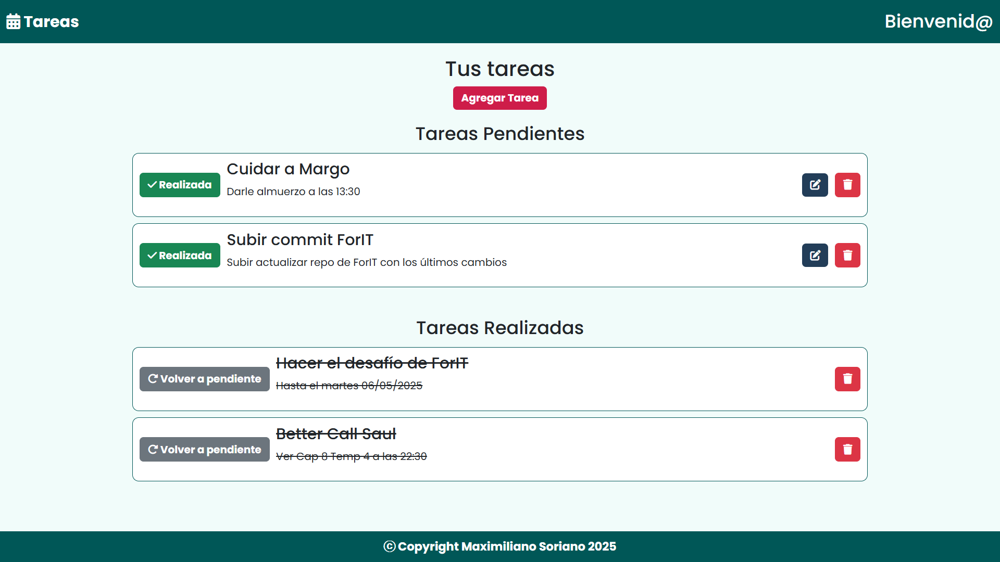
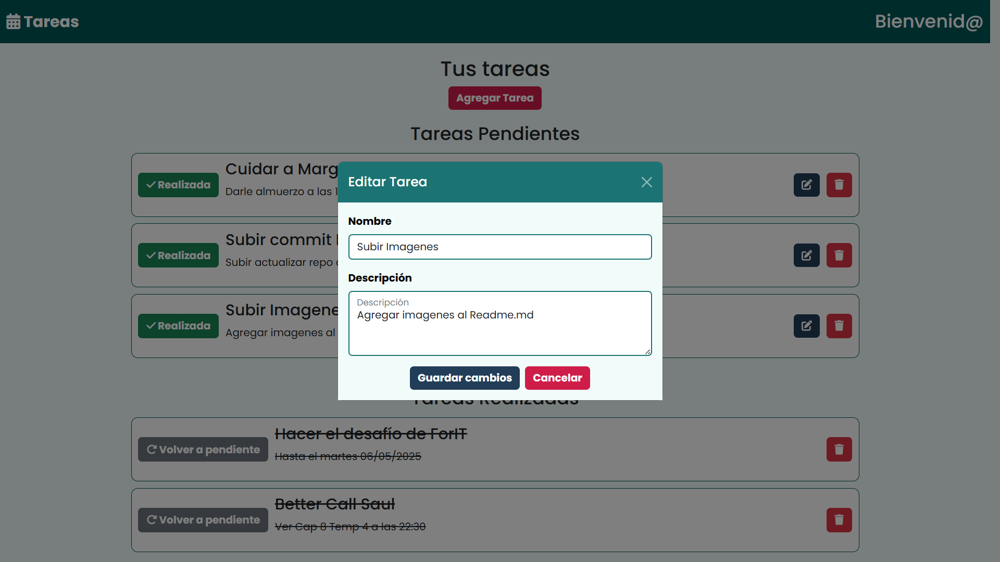
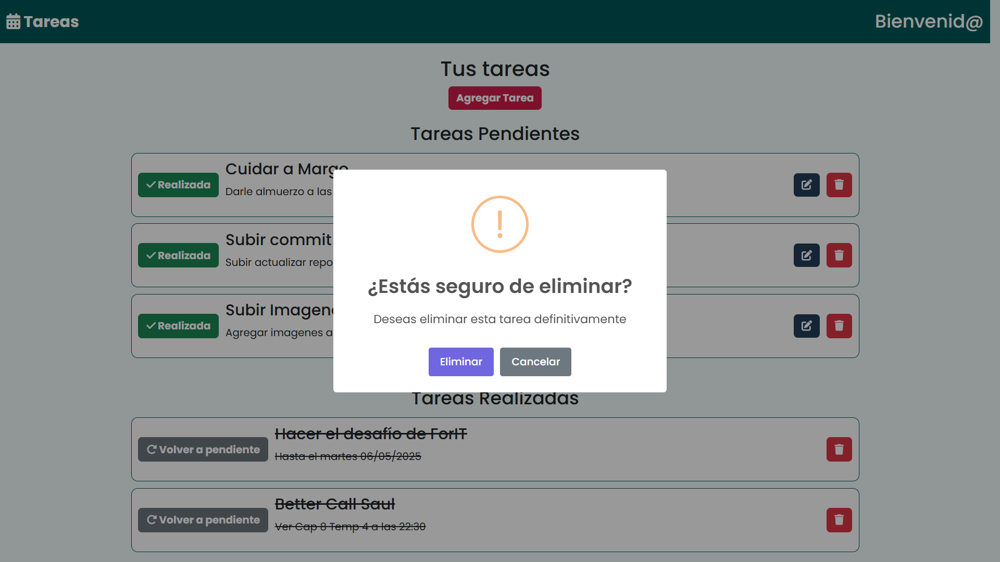
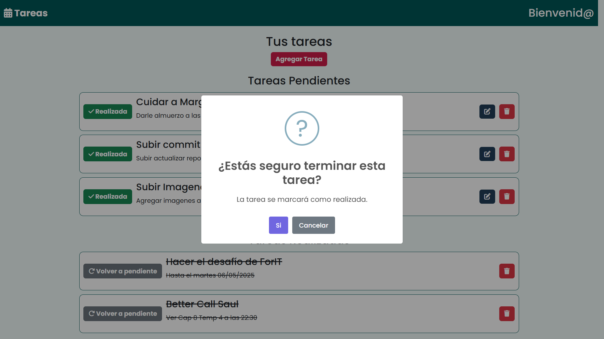
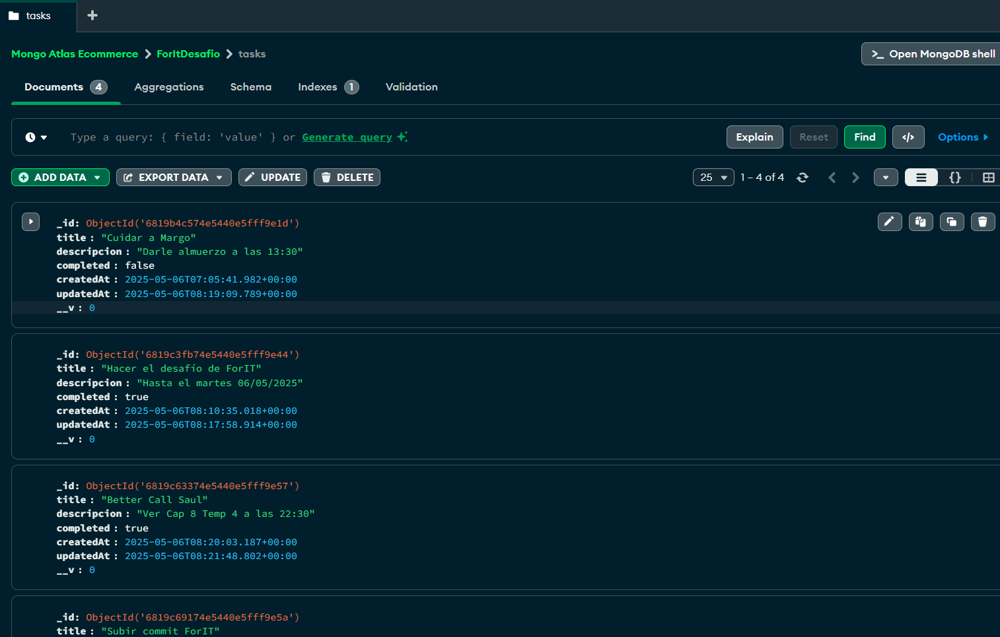

# Challenge ForIT 2025

## Autor

**Maximiliano Soriano**

---

## Tecnologías Utilizadas

### Frontend
- **React** (con `react-router-dom`)
- **CSS**
- **Bootstrap**
- **Font Awesome**
- **SweetAlert2**
- **Google Fonts**

### Backend
- **Node.js**
- **Express**
- **Mongoose**
- **MongoDB Atlas**
- **MongoDB Compass**
- **Postman**
- **dotenv**
- **cors**

---

## Instrucciones para ejecutar el proyecto

### Frontend

1. Clonar el repositorio:
   ```bash
   git clone https://github.com/MaxiSoriano70/FORIT-2025-TASK.git

2. Navegar a la carpeta del frontend y ejecutar:
   ```bash
   npm install
   npm run dev

3. La aplicación estará corriendo en:
   ```bash
   Local: http://localhost:5173/

### Backend

1. Crear un archivo .env en la raíz del proyecto backend con el siguiente contenido:
   MONGO_DB=mongodb+srv://<USER>:<PASSWORD>@ecommerce-cluster.wxteo.mongodb.net/ForItDesafio

2. Instalar las dependencias y levantar el servidor:
   ```bash
   npm install
   npm run dev






